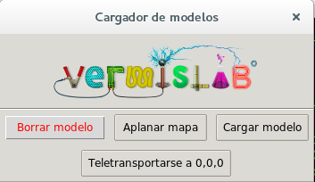
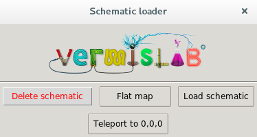

# Minecraft Pi Schematic Loader
Loads a schematic into a Minecraft Pi world

### Installation

This program requires Tkinter. You can install it in Debian-based systems with `sudo apt-get install python-tk`. For all other dependencies, please check [requirements.txt](requirements.txt). They are installable via PIP.

### Usage

You can run this program with `python schematic.py`. The GUI will only appear when Minecraft is open and ready.

There are two versions available, one in [English](schematic_en.py) and the other in [Spanish](schematic_es.py).
|  |  |

### Contributors

Development:
 *  [@ResonantWave](https://github.com/ResonantWave)

### Contributing

* The code is licensed under the [GPL V3](LICENSE)
* Feel free to contribute to the code

### Other

 * The original Minecraft Pi API, made by Mojang AB, is included for convenience reasons. 
 * This tool was created for the Tinkercad and Minecraft workshop, made by [VermisLAB](http://www.vermislab.com/). 
 * VermisLAB, and the VermisLAB logo are property of [Vermis Project](http://www.vermisproject.com/), and neither can be used without autorization.
